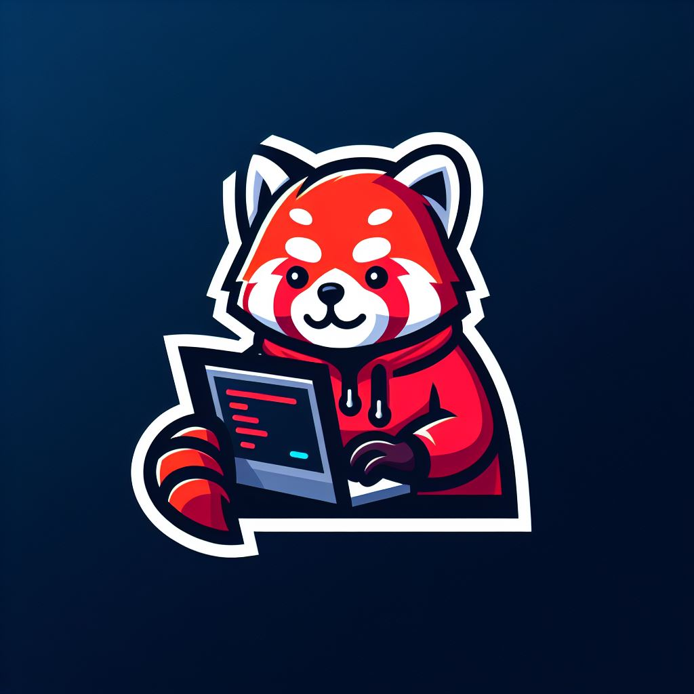

<!-- Improved compatibility of back to top link: See: https://github.com/othneildrew/Best-README-Template/pull/73 -->
<a name="readme-top"></a>
<!--
*** Thanks for checking out the Best-README-Template. If you have a suggestion
*** that would make this better, please fork the repo and create a pull request
*** or simply open an issue with the tag "enhancement".
*** Don't forget to give the project a star!
*** Thanks again! Now go create something AMAZING! :D
-->


<!-- PROJECT SHIELDS -->
<!--
*** I'm using markdown "reference style" links for readability.
*** Reference links are enclosed in brackets [ ] instead of parentheses ( ).
*** See the bottom of this document for the declaration of the reference variables
*** for contributors-url, forks-url, etc. This is an optional, concise syntax you may use.
*** https://www.markdownguide.org/basic-syntax/#reference-style-links
-->


<!-- PROJECT LOGO -->
<br />
<div align="center">
  <a href="https://github.com/othneildrew/Best-README-Template">
    
  </a>

  <h3 align="center">MINISHELL</h3>


</div>


<!-- TABLE OF CONTENTS -->
<details>
  <summary>Table of Contents</summary>
  <ol>
    <li>
      <a href="#about-the-project">About The Project</a>
    </li>
    <li>
      <a href="#getting-started">Getting Started</a>
      <ul>
        <li><a href="#installation">Installation</a></li>
      </ul>
    </li>
    <li><a href="#contact">Contact</a></li>
  </ol>
</details>


<!-- ABOUT THE PROJECT -->
## About The Project

The Minishell project is a key milestone in systems programming, 
designed to deepen understanding of Unix-based systems and shell functionality. 

The goal is to create a simplified version of the Unix shell, 
simulating the behavior of common shell environments like Bash or Zsh.

**Key Features of the Minishell Project:**
- Prompt Display: Your shell will display a prompt, allowing users to input commands interactively.

- Command Execution: The shell should handle both built-in commands (like echo, cd, exit, etc.) as well as external programs. This includes the ability to run programs located in system paths.

- Pipes and Redirections: Support for piping (|) between multiple commands and redirection (<, >) is essential. This enables chaining commands and directing input/output between files and commands.

- Environment Variables: Your shell should recognize and manage environment variables, giving users access to system configurations, such as $PATH.

- Error Handling: The shell must provide appropriate error messages for invalid commands, syntactic mistakes, or permission errors, ensuring smooth user experience.

**Bonus Features:**
- Logical Operators (&&, ||): The shell should support logical operators for conditional execution of commands, allowing users to chain commands that depend on the success or failure of the previous command.

- Parentheses Handling: Implement support for grouping commands with parentheses, allowing the user to execute multiple commands in subshells.

- Wildcards (*): Support for wildcard expansion, enabling commands to match patterns for filenames or directories.

- History: As a bonus, your shell can include features like command history, improving user convenience and usability.


<p align="right">(<a href="#readme-top">back to top</a>)</p>


<!-- GETTING STARTED -->
## Getting Started

### Prerequisites

This is a C program so you need to have gcc compiler.
  ```sh
  sudo apt-get install gcc -y
  ```

### Installation

1. Clone the repo
   ```sh
   git clone https://github.com/Lyyrst/Libft.git
2. Makefile !
   ```sh
   make && make clean
   ```
<p align="right">(<a href="#readme-top">back to top</a>)</p>


<!-- USAGE EXAMPLES -->
## Usage

Once the minishell successfuly compile, use this command :
```sh
./minishell
```
Your now using minishell
<p align="right">(<a href="#readme-top">back to top</a>)</p>

<!-- CONTACT -->
## Contact

[Discord : lyrst](https://discord.com/users/257192704537001984)

kurt.butorp@gmail.com

## Reminder

Please remember that this project is one of the first i did as a computer science learner, it does not reflect my actual skills but through which project i learned programming.
